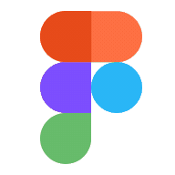

  
   
   
  <h2>
    Hi There!
    
  </h2>

   

I am a senior year CS student based in **[Mumbai, India](https://goo.gl/maps/pL8E4Zeh4iASa1wJ9)** currently exploring Machine Learning & Web Development. 
I am passionate about designing and developing practical, fast, and efficient applications using a range of technologies and languages. I enjoy experimenting with electronics as a hobby. 
Moreover, I have a soft spot for cats! 🐈
   

Please feel free to clone/fork my projects, raise issues, and submit pull requests if you believe something could be improved. You can ask me anything **[here](https://github.com/siddAhmed/siddAhmed/issues/new)** or you can also send me an **<a href="mailto:ahmedsidd45@gmail.com">email</a>**.
   
   

  

## Tech Stack I'm Familiar With

   
  
  
  

   
  
  
  

   
  
  
  

   
  
  
  
  

 
  

    
My latest projects 🚀

		 

  <picture>
    <source
      srcset="https://github-readme-stats.vercel.app/api/pin/?username=siddAhmed&repo=PeerEdit&theme=material-palenight"
      media="(prefers-color-scheme: dark)"
    />
    <source
      srcset="https://github-readme-stats.vercel.app/api/pin/?username=siddAhmed&repo=PeerEdit&theme=solarized-light"
      media="(prefers-color-scheme: light), (prefers-color-scheme: no-preference)"
    />
    
  </picture>

  <picture>
  <source
    srcset="https://github-readme-stats.vercel.app/api/pin/?username=siddAhmed&repo=webrtc-demo&theme=material-palenight"
    media="(prefers-color-scheme: dark)"
  />
  <source
    srcset="https://github-readme-stats.vercel.app/api/pin/?username=siddAhmed&repo=webrtc-demo&theme=solarized-light"
    media="(prefers-color-scheme: light), (prefers-color-scheme: no-preference)"
  />
  
  </picture>

  <picture>
    <source
      srcset="https://github-readme-stats.vercel.app/api/pin/?username=siddAhmed&repo=meal-suggestor&theme=material-palenight"
      media="(prefers-color-scheme: dark)"
    />
    <source
      srcset="https://github-readme-stats.vercel.app/api/pin/?username=siddAhmed&repo=meal-suggestor&theme=solarized-light"
      media="(prefers-color-scheme: light), (prefers-color-scheme: no-preference)"
    />
    
  </picture>

    
  

   
  
   

